# Lab Assignment (Fall 2025)

This lab is about the deployment of a micro-service application in a Kubernetes cluster, the management of this application and of the cluster. It includes a set of mandatory steps as well as additional steps that will allow you to extend the work in different directions.

## Authors

- Laura Keidann Rodrigues Da Silva - laura.keidann@grenoble-inp.org
- Vinícius Bergonzi Lazzari - vinicius.bergonzi-lazzari@grenoble-inp.org

## Base steps [Mandatory]

### GKE configuration

Starting the necessary services.
```
gcloud services enable compute.googleapis.com
gcloud services enable container.googleapis.com
```

Configuring the default compute and zone of the project.
```
gcloud config set compute/zone europe-west6-a
```

Create a new cluster called `microservices-demo`. Using the default GKE configuration (e2-medium machine type, 3 nodes).

```
gcloud container clusters create microservices-demo

    NAME: microservices-demo
    LOCATION: europe-west6-a
    MASTER_VERSION: 1.33.5-gke.1201000
    MASTER_IP: 34.65.63.7
    MACHINE_TYPE: e2-medium
    NODE_VERSION: 1.33.5-gke.1201000
    NUM_NODES: 3
    STATUS: RUNNING
    STACK_TYPE: IPV4
```

### Deploying the original application in GKE

Apply the default Kubernetes configuration to deploy the project.
```
kubectl apply -f ./release/kubernetes-manifests.yaml
```

Checking if all services where successfully deployed.

```
kubectl get pods
    NAME                                     READY   STATUS    RESTARTS   AGE
    adservice-54fdcb4646-jnzv9               0/1     Pending   0          10m
    cartservice-7d76bb9df-bbzp9              1/1     Running   0          10m
    checkoutservice-5d9d84cd44-7twgf         1/1     Running   0          10m
    currencyservice-569f6c566d-sm7zf         1/1     Running   0          10m
    emailservice-7d4b8cd7d6-lpnd9            1/1     Running   0          10m
    frontend-76dbbddfc5-wvpqt                1/1     Running   0          10m
    loadgenerator-56674fd696-kn2c9           0/1     Pending   0          10m
    paymentservice-9ff6ffd6-s8hhn            1/1     Running   0          10m
    productcatalogservice-74c67b9d8b-qq6bf   1/1     Running   0          10m
    recommendationservice-5966b9f59d-4dcng   1/1     Running   0          10m
    redis-cart-c4fc658fb-wnfnj               1/1     Running   0          10m
    shippingservice-5565748dc4-llkbl         1/1     Running   0          10m
```

Not all containers of the application managed to start. The default configuration for a GKE cluster does not have enough resources to satisfy all the requirements of the default configuration.

#### Briefly explain what is this Autopilot mode and why it hides the problem.

Autopilot mode is a mode of operation in GKE where Google will manage all the configurations of the cluster for the user, such as autoscaling, security and nodes. If a service needs more resources, such as loadgenerator in this case, autopilot will automatically adapt and scale the cluster. With autopilot, GKE would scale up and provide more resources.

It can cause problems because the user doesn't have the control over the cluster anymore, which can lead to many undesired behaviors and a conflict of interests with Google, since the company that is managing the cluster will benefit from a high usage of computer resources, for example.

### Reconfiguring the application

Delete all running services.

```
kubectl delete -f ./release/kubernetes-manifests.yaml
```

Create new Kubernetes config using Kustomize.

```
cd kustomize
kustomize edit add component components/without-loadgenerator
kubectl kustomize .
```

Re-create services.

```
kubectl apply -k .
```

Now we can see that the load-generator service is not deployed anymore with the current Kubernetes manifest.

```
kubectl get pods
    NAME                                     READY   STATUS    RESTARTS   AGE
    adservice-54fdcb4646-xm26z               1/1     Running   0          18m
    cartservice-7d76bb9df-rk9vb              1/1     Running   0          18m
    checkoutservice-5d9d84cd44-x7wbd         1/1     Running   0          18m
    currencyservice-569f6c566d-cbp6s         1/1     Running   0          18m
    emailservice-7d4b8cd7d6-b5xcx            1/1     Running   0          18m
    frontend-76dbbddfc5-pk8q9                1/1     Running   0          18m
    paymentservice-9ff6ffd6-8jt22            1/1     Running   0          18m
    productcatalogservice-74c67b9d8b-w6k7k   1/1     Running   0          18m
    recommendationservice-5966b9f59d-zdtjs   1/1     Running   0          18m
    redis-cart-c4fc658fb-vpmlr               1/1     Running   0          18m
    shippingservice-5565748dc4-9b2js         1/1     Running   0          18m
```
All the containers have all the resources they need to start.

To automate this initial step, we created the `create-and-deploy.sh` script, which creates the cluster using the GKE default configuration. The cluster name and zone can be passed as parameters.

#### Which of the two parameters (`requests` and `limits`) actually matters when Kubernetes decides that it can deploy a service on a worker node?

During deploy phase, the `requests` parameter is the one observed, where a service is not deployed if it's node cannot handle the desired `request` of the service. The limit is a parameter to be observed during runtime, where a service is forbidden to use more computing and memory than it's `limits` parameter allows it.

#### Select 2 services among those that seem less critical in the application to reduce their resource requirement and justify your choices in the report

##### AdService

Since it's not part of the core infrastructure of the system and it's not part of the buying workflow, this service can have it's computing power decreased, in order to keep the total computing power inside the desired constraints.

In our system, we set the `request` parameter to 100m (from 200m) and the `limits` parameter to 150m (from 300m).

##### EmailService

We think that this service is not critical and does not resource heavy since it consists of only sending emails and it's done after the buying pipeline, which should compromise to much the user experience on a real system.

In our system, we set the `request` parameter to 50m (from 100m) and the `limits` parameter to 100m (from 200m).

### Analyzing the provided configuration
#### PaymentService

We have chosen to analyze the configuration file of the PaymentService. The file contains the definition for three Kubernetes objects: Deployment, Service, and ServiceAccount. Some parameters define names and labels used to identify the objects, as well as environment variables. Below we describe the most significant parameters.

The first section contains the parameters related to Deployment, with the information on how to run the application:
- `terminationGracePeriodSeconds: 5` defines that Kubernetes should wait for 5 seconds for a Pod that has been deleted to shut down before forcefully killing it. Kubernetes sends SIGTERM to the containers, waits for 5 seconds, then sends SIGKILL if they are still running.
- Pod-level `securityContext`:
  - `fsGroup: 1000`: Files created in mounted volumes belong to group 1000.
  - `runAsGroup: 1000`: Processes will run with the group ID 1000.
  - `runAsNonRoot: true`: The pod cannot run as the root user.
  - `runAsUser: 1000`: Processes will run with the user ID 1000.
- Container definition inside `containers`: this deployment only has a single container.
  - Container-level `securityContext`:
    - `allowPrivilegeEscalation: false` prevents the container's process from gaining more privileges than it started with.
    - `capabilities: drop: - ALL` drops all special "Linux capabilities", restricting what the container can do.
    - `privileged: false` ensures that the container does not run in "privileged" mode.
    - `readOnlyRootFilesystem: true` ensures that the container's files cannot be modified.
  - `image: us-central1-docker.pkg.dev/google-samples/microservices-demo/paymentservice:v0.10.3` defines the specific Docker image that has to be pulled and run.
  - `ports: containerPort: 50051` tells Kubernetes that the application inside the container is listening on port 50051.
  - `readinessProbe: grpc: port: 50051` defines how Kubernetes checks if the container is ready to receive traffic. In this case it performs a gRPC health check on port 50051.
  - `livenessProbe: grpc: port: 50051`: defines how Kubernetes checks if the container is alive and healthy. If it fails, Kubernetes assumes the container is broken and restarts it.
  - `resources` defines the CPU and memory resources for the container.
    - `requests`: The guaranteed minimum.
      - `cpu: 100m`: 100 millicpu (0.1 CPU).
      - `memory: 64Mi`: 64 mebibytes of RAM.
    - `limits`: The maximum amount of resources the container is allowed to use.
      - `cpu: 200m`: 200 millicpu (0.2 CPU).
      - `memory: 128Mi`: 128 mebibytes of RAM.

The Service definition describes how the service is exposed. In the specification (`spec`) section, we find the following parameters:
- `type: ClusterIP`: Default type. Exposes the Service only on an internal IP address within the cluster. It's not reachable from outside the cluster.
- `selector: app: paymentservice:` Selects the Pods with this label (link to the Deployment Pods).
- `ports` defines the port mapping:
  - `port: 50051`: the port  exposed by the Service.
  - `targetPort: 50051`: the container port number inside the Pod.

Finally, the third section corresponds to the ServiceAccount, which creates a cluster-level identity for the application with the name `paymentservice`, referenced by the Deployment's `serviceAccountName: paymentservice`.

### Deploying the load generator on a local machine

This load generator was deployed using the Google Shell in order to avoid conflicts between different instruction set architectures.

We first need to build the image of the load generator.

```
cd src/loadgenerator
docker build -t loadgenerator .
```

Then we can obtain the frontend service `EXTERNAL-IP`, which is going to be used as our entry point in order to generate load into the system.

```
kubectl get service frontend-external | awk '{print $4}'
    EXTERNAL-IP
    34.65.30.228
```

Finally, we can run the previously compiled image with this IP as the target, with optional parameters as the number of users and pooling rate.

```
docker run --rm -p 8089:8089 -e FRONTEND_ADDR=34.65.30.228 -e USERS=10 -e RATE=10 loadbalancer
    Response time percentiles (approximated)
    Type     Name                                                                                  50%    66%    75%    80%    90%    95%    98%    99%  99.9% 99.99%   100% # reqs
    --------|--------------------------------------------------------------------------------|--------|------|------|------|------|------|------|------|------|------|------|------
    GET      /                                                                                     900    960   1100   1100   1100   1100   1100   1100   1100   1100   1100     14
    GET      /cart                                                                                  36     44     54     55    110    120    120    120    120    120    120     20
    POST     /cart                                                                                  63     66     67     67    220    300    300    300    300    300    300     20
    POST     /cart/checkout                                                                         61     61     67    180    260    260    260    260    260    260    260      9
    GET      /product/0PUK6V6EV0                                                                    38     39     40     40     41    200    200    200    200    200    200     11
    GET      /product/1YMWWN1N4O                                                                    36     37     38     38     38     41     41     41     41     41     41     11
    GET      /product/2ZYFJ3GM2N                                                                    36     41     44     44    310    310    310    310    310    310    310      8
    GET      /product/66VCHSJNUP                                                                    37     38     39     39     41     42     42     42     42     42     42     11
    GET      /product/6E92ZMYYFZ                                                                    36     37     38     41     53     53     53     53     53     53     53     10
    GET      /product/9SIQT8TOJO                                                                    40     43     46     46     49    200    200    200    200    200    200     13
    GET      /product/L9ECAV7KIM                                                                    38     38     38     38     40     40     40     40     40     40     40      7
    GET      /product/LS4PSXUNUM                                                                    40     40     41    190    310    310    310    310    310    310    310     10
    GET      /product/OLJCESPC7Z                                                                    38     38     41     42     43    220    220    220    220    220    220     18
    POST     /setCurrency                                                                           67     68     72     84    140    140    160    160    160    160    160     25
    --------|--------------------------------------------------------------------------------|--------|------|------|------|------|------|------|------|------|------|------|------
            Aggregated                                                                             41     58     64     67    200    700   1100   1100   1100   1100   1100    187
```

### Deploying automatically the load generator in Google Cloud

This task was completed using the scripts inside the `loadgenerator` folder. The idea is to create a virtual machine in GKE using Terraform and capture it's IP address. Later, this address is used by Ansible to stablish a SSH connection with the machine, clone the `locust` test script and execute it. All this process is managed by a python script `deploy.py`, receiving the IP address of the frontend, the number of desired users and pooling rate for testing.

If everything works well, a virtual machine should be deployed inside GKE, executing the `locust` test script with the desired parameters. The script `destroy.py` can be used to destroy the current virtual machine.

## Advanced steps

### Monitoring the application and the infrastructure

This section describes the monitoring infrastructure. Before implementing our own monitoring infrastructure, we initially deployed the monitoring stack using Helm and the community-maintained `kube-prometheus-stack` chart. The objective was to better understand the monitoring components necessary for observing a cluster at both the node and pod levels, and understand how the metrics are exposed, how Prometheus is configured to scrape the metrics, and how the results can be presented in Grafana dashboards. After understanding the end results, we implemented our own monitoring stack manually using Kubernetes manifests, deploying Prometheus, Grafana, Node Exporter and cAdvisor explicitly. This approach gave full control over the configuration and ensured an understanding of the monitoring pipeline.

The code corresponding to this section can be found in the `monitoring` directory, which contains a `README` with detailed instructions on how to apply and test each part of the monitoring stack. The stack is based on Prometheus (for collecting data) and Grafana (to produce dashboards). Both are deployed inside the Kubernetes cluster, in a monitoring namespace.

- **Prometheus:** is responsible for collecting data. It is deploying inside the cluster abd scrapes data every 15s. It has 3 scrape jobs: self-monitoring, Node Exporter (to get node-level information) and cAdvisor (to get pod-level information).

- **RBAC:** We had to create a Role-Based Access Control authorization to to enable Prometheus to monitor the Kubernetes cluster. We created a dedicated ServiceAccount in the monitoring namespace. This ServiceAccount was granted a ClusterRole defining the necessary read-only permissions to access cluster resources. A ClusterRoleBinding was then used to associate the ServiceAccount with this ClusterRole, allowing the Prometheus pod to authenticate securely and query the Kubernetes API.

- **Node Exporter:** is deployed as a DaemonSet so that a pod runs on every node in the cluster, collecting metrics such as CPU usage, memory usage, disk usage, and network I/O. It exposes these metrics on port 9100, allowing Prometheus to scrape them directly from each node.
- **cAdvisor:** is also deployed as a DaemonSet and runs on every node to collect container-level metrics, including CPU, memory, disk, and network usage for each container.Prometheus scrapes these metrics via cAdvisor to visualize container performance, detect bottlenecks, and troubleshoot application issues.
- **Grafana:** is deployed as a single replica Deployment, with ConfigMaps providing pre-configured dashboards and a Prometheus data source, simplifying setup and enabling immediate visualization of the metrics:
  - Node Resource Usage Dashboard: CPU usage per node, Memory usage per node, Disk usage per node, Network I/O per node.
  - Pod Resource Usage Dashboard: CPU usage per pod, Memory usage per pod, Network I/O per pod, Pod restarts over the last hour.

We had to test different combinations of requested resources for Prometheus and Grafana to be able to deploy all of the components. Eventually, we settled on 50m cpu, 256Mi memory for Prometheus (limited at 200m, 512Mi) and on 50m cpu, 100Mi memory for Grafana (limited at 100m, 512Mi), which seemed to be enough.

#### Deployment steps

```
# Run the monitoring stack creation script
# which creates the namespace and deploys the monitoring infrastructure

cd scripts
./create-monitoring-stack.sh

# Access the Grafana service with `kubectl port-forward`
kubectl -n monitoring port-forward svc/grafana 3000:3000

# Access the dashboards and view the collected data
http://localhost:3000/

with user/password = admin
```

#### Experiments
When implementing the configuration, we tested every separate component by accesing the services with `kubectl port-forward`. We could verify that Prometheus could scrape the metrics from Node-Exporter and cAdvisor. To be able to get interesting results, we executed the load generator code and analysed the Grafana dashboards. Initially, we only displayed CPU usage for both nodes and pods. Later we added other metrics to get more information about the state of application.

#### Results

50 users rate=5, 1 min and 100 users, rate=10, 5 min


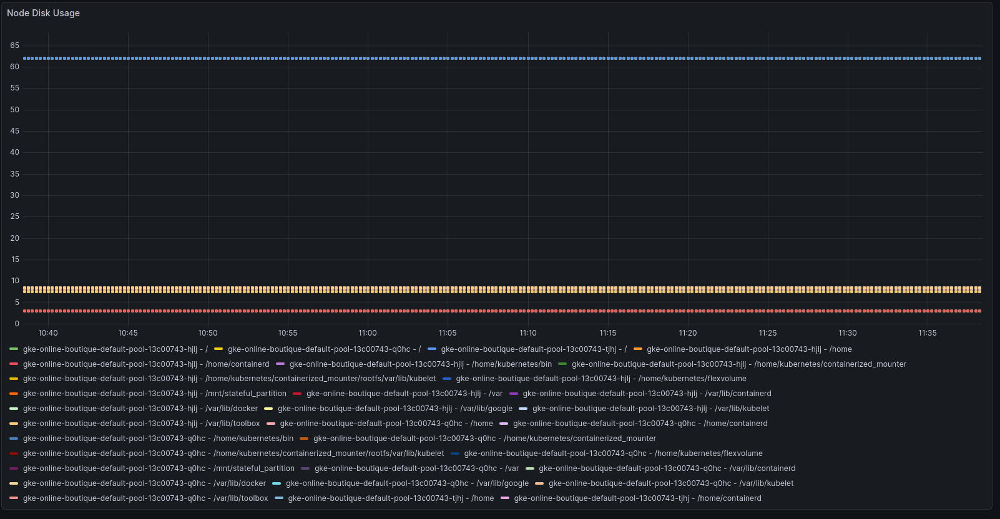

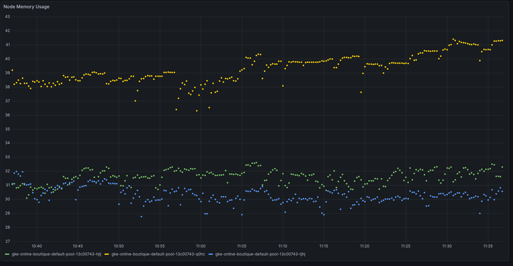

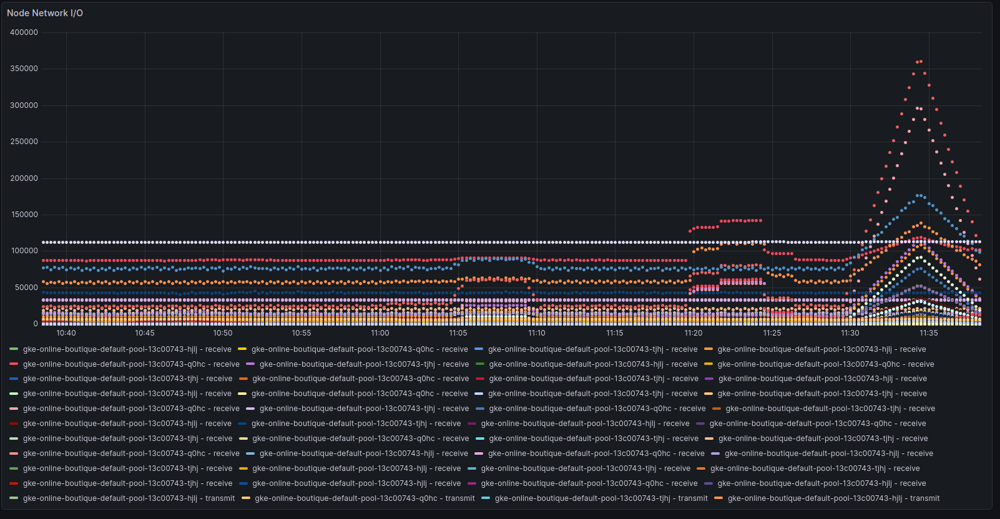

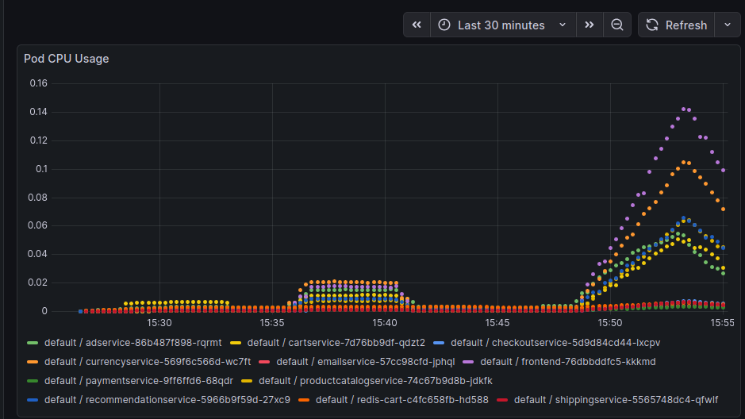

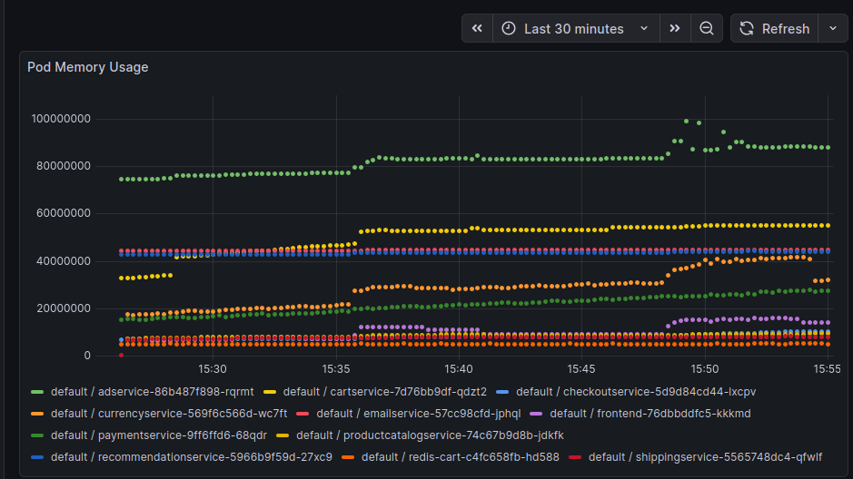

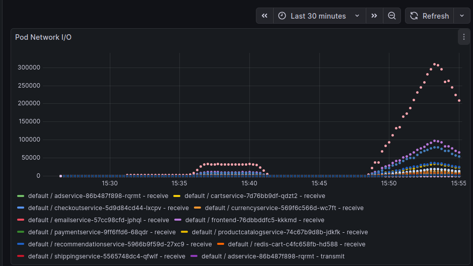

Looking at the dashboards, we realized that we were displaying data for all the pods, including those belonging to  `kube-system` and `gmp-sytems` namespaces, as well as from our own `monitoring` namespace. We decided to filter only by the `default` namespace to display the application metrics.

### Performance evaluation

In order to do the performance evaluation, we created the folder `loadgenerator`, which uses `locust` alongside some infrastructure-as-code tools like
`terraform` and `ansible` to deploy a load generator for any specific IP, in this case the `frontend` IP of the cluster.

The `deploy.py` script works as follows:

1. Receives the arguments: `<frontend_ip> <users> <rate> [run_time] [csv_prefix]`.
1. Create a new SSH key on the `keys` folder, if none exists.
1. Deploy a new VM using terraform with the public key that was just created.
1. Get the VM IP and configure `ansible` using it and the private key.
1. `ansible` will configure the machine and install the necessary dependencies.
1. Run `locust` on the new VM using the arguments received in step 1.
1. Collect results from the new VM to local folder `results`.
1. Destroy the VM.

This ensures a smooth flow of testing, where all the infrastructure is created from the ground up and destroyed in the end.

`terraform` will also create the new VM on the cluster region that was used to create the cluster, which ensures that no real network bottleneck will be
observed since both the deploy cluster and the load generator VM will be very close to each other.

#### Results

The main tested used to generate the results involved `users = 500`, `rate = 2` and `run_time = 5m`.

The raw data was saved and the script `analyze_results.py` was used to generate both plots available below.

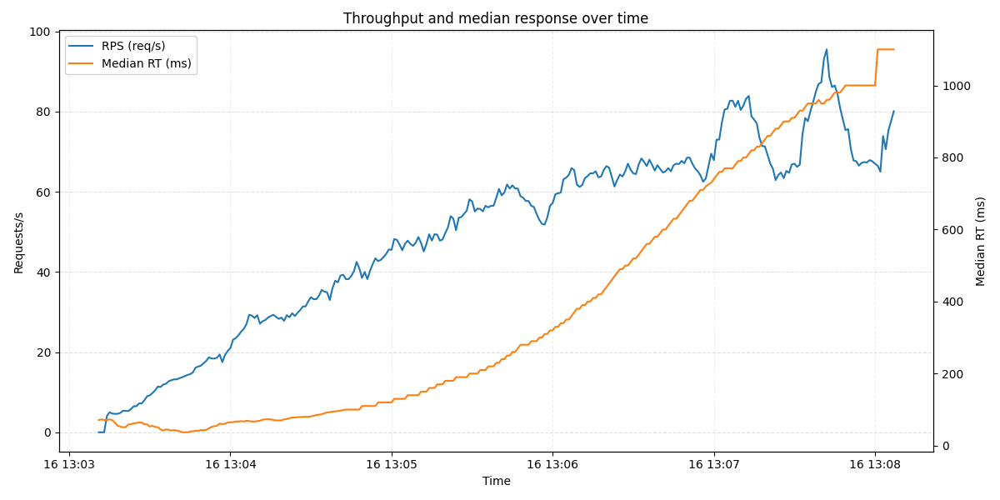

The plot shows the correlation between how much work the system does (RPS) and how fast it responds (Median RT).

- Traffic (RPS): The blue line shows the number of requests per second. It starts at zero and climbs steadily, reaching a peak of about **95 requests per second**.
- Speed (Median RT): The orange line shows the middle-ground response time in milliseconds. For the first half of the test, the system stays fast, keeping wait times under **200ms**.

The Slowdown: Once the traffic passes 50 requests per second (around the 13:05 point), the system starts to slow down. The wait times jumps, eventually reaching over 1000ms by the end of the test.

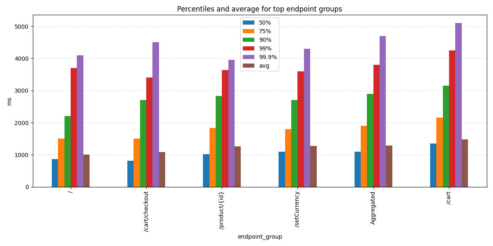

In order to understand which parts of the application were causing the slowdown, we analyzed the performance of the top 10 endpoint groups.

By looking at the bar chart, we can see that almost every service had a median response time (50%) near **1000ms**, which matches the spike we saw at the end of the timeseries test.

The `/cart` endpoint stands out as the biggest bottleneck, where the slowest requests (99.9%) actually exceeded **5000ms**. Across all services, there is a very large gap between the average time and the higher percentiles, which confirms that the system was struggling to stay consistent as load increased.

### Canary releases — ProductCatalogservice v2

This section describes how to deploy a canary for `productcatalogservice` (v2) and how to validate traffic splitting.

- **Code change (v2):** `src/productcatalogservice_v2/server.go` was updated to log `service version: v2` and to use profiling version `2.0.0` so the instance can be easily identified in logs.

- **Kubernetes manifests:**
  - Updated `kubernetes-manifests/productcatalogservice.yaml` to add label `version: v1` to the v1 Deployment and pod template.
  - Added `kubernetes-manifests/productcatalogservice-v2.yaml` which creates a Deployment for v2 with labels `app: productcatalogservice` and `version: v2`. The existing Service `productcatalogservice` keeps selecting pods with `app: productcatalogservice`.

- **Istio routing:** Added `istio-manifests/productcatalogservice-canary.yaml` containing:
  - `DestinationRule` with subsets `v1` and `v2` (selecting pods by label `version`).
  - `VirtualService` routing 75% of traffic to subset `v1` and 25% to subset `v2`.

Deployment steps:

Before everything, the user needs to be sure that `istio` is correctly installed in the destination cluster, this can be done using the following commands:

```
curl -L https://istio.io/downloadIstio | sh -
cd istio-1.28.1
export PATH=$PWD/bin:$PATH
istioctl install --set profile=demo -y
```

After this step, `istio` will create some `pods` and `services` on the cluster, as the `control-plane`, `ingress gateway`, `egress gateway`...
This services are responsible to manipulate the incoming traffic to the cluster and redirect it following the virtual rules defined by the user,
in this case, the rule was to split the traffic to `product-catalog` between to versions, with `25%` and `75%` of the traffic respectfully.


After installing `istio` on the cluster, the user can the add the rule `with-canary` to `kustomize`, in order to create a new `manifest` with the
new version of `product-catalog` and the split rule.

```
kustomize edit add component components/with-canary
kubectl kustomize .
```

Finally, the new configuration can be used to deploy the new pods and rules.

```
kubectl apply -k .
```

Running `kubectl get pods --all-namespaces` now should give the following result.

```
// Both versions of the product-catalog service
default           productcatalogservice-85f8c79c75-hdd28                         2/2     Running   0          35m
default           productcatalogservice-v2-758965c6f8-tg5k9                      2/2     Running   0          35m

// Istio pods and services
istio-system      istio-egressgateway-6f6bb8f7f9-s47cq                           1/1     Running   0          61m
istio-system      istio-ingressgateway-7b787c97fc-6kw8r                          1/1     Running   0          61m
istio-system      istiod-877576bdc-klzfp                                         1/1     Running   0          62m
```

If the traffic split is not working be default, is necessary to allow `istio` to inject 
traffic inside the pods, which may be disabled by default, this can be done with the
following commands.

```
# Enable injection
kubectl label namespace default istio-injection=enabled --overwrite

# Restart the deployments and pods
kubectl rollout restart deployment -n default
```

### Validating the traffic split

To validate the traffic split, we used the `kiali` tool, a visualization tool to observe the deploy and traffic of namespaces inside a cluster.

In order to do this, it was necessary to install two addons to the already existing `istio` installing: `kiali` and `prometheus`. This can be done
using the following commands.

```
kubectl apply -f ./samples/addons/kiali.yaml
kubectl apply -f ./samples/addons/prometheus.yaml
```

After the install, new `pods` should be available at the cluster, confirming that the new plugins are already available.

```
istio-system      kiali-7b58697666-cvwnl                                         1/1     Running   0          47m
istio-system      prometheus-7c48c5c5c7-vfct8                                    2/2     Running   0          6m53s
```

Running the command `istioctl dashboard kiali` start a `localhost` dashboard, that can be used to inspect what is happening on the cluster.


Here we can see the full connection tree between the services of the cluster. We can validate that the split is working by looking only to the
`productcatalogservice`. We can see that there are two versions of the service running, as well as the successful requests that reached each one
of the individual services.

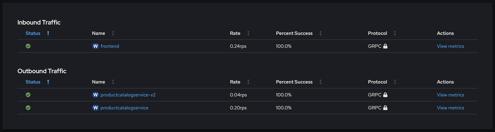

If we take a look only at the `productcatalog` service, we can observe that the `inbound` traffic is coming only from the `frontend`, which makes sense,
but the `outbound` traffic is divides between `productcatalogservice` and `productcatalogservice-v2`, where the rate for the first is roughly **0.2rps**
while for the second we have **0.04rps** after some refreshes, so we can validate that the percentages are working as well.

### Completely rolling out the new version

In order to completely rollout the old version once the new version is validated, we can simply update the parameters of the `productcatalogservice-vs` to
route **100%** of the traffic to the `v2` version and **0%** to `v1`.

```
kubectl patch virtualservice productcatalogservice-vs -n default \
  --type merge -p '{
    "spec": {
      "http": [{
        "route": [
          {"destination":{"host":"productcatalogservice","subset":"v1"},"weight":0},
          {"destination":{"host":"productcatalogservice","subset":"v2"},"weight":100}
        ]
      }]
    }
  }'

virtualservice.networking.istio.io/productcatalogservice-vs patched
```


We can see that even after many refreshes and incoming traffic, the only version of `productcatalogservice` being used is the `v2` one.

Now we can safelly disable the delete the old replicas of `v1`.

```
kubectl delete deploy productcatalogservice -n default

deployment.apps "productcatalogservice" deleted from default namespace
```

## Bonus steps

### Canary releases (Bonus)

For this step, it was necessary to implement one service with a defect, in this case an artificial one, then
do a deploy using splitted traffic with `istio` and detect possible problems with the new deployed version, rolling
out the service in case of any problem.

In order to do this, the `productcatalog` service was used, just like in the **Advanced Step of Canary versions**.
A `v3` version was created, in `src/productcatalogservice_v3`. This version is exactly the same as the `v2`, but
with an artificial delay of `3s` on each request.

Then, new manifests and destination rules were created under `kustomize/components/with-canary-rollback`. They
are exatcly the same as the ones used for the **Advanced Step**, but with one difference: this rule has a 
exception where every time the **header** `x-canary-test: v3` is found in any request, the `v3` version (defective
one) is always used. This was done to validate the only the new version on the test script.

```
spec:
  hosts:
  - productcatalogservice
  http:
  - match:
    - headers:
        x-canary-test:
          exact: v3
    route:
    - destination:
        host: productcatalogservice
        subset: v3
      weight: 100
  - route:
    - destination:
        host: productcatalogservice
        subset: v1
      weight: 80
    - destination:
        host: productcatalogservice
        subset: v3
      weight: 20
```

By using this rule, we can use the `scripts/canary_test_and_rollback.sh` to do the following:

1. Test the current latency of the `v1` version.
1. Deploy the `v3` version and `istio` rules.
1. Wait for the pods to be running and healthy.
1. Test the latency of the newly deployed version using `x-canary-test: v3`.
1. If the latency is beyond the `threshold` value defined by the user, rollout the `v3` version and `istio` rules.
1. Otherwise, keep the `v3` version and `istio` rules in the cluser.

By doing this we can verify that the newly deployed version of a service is working and immediatly rollback
in case of any problems. 

This setup could be improved by using actual `prometheus` metrics of the newly created pod to check for any
problems, since leaving a **header** like this in a production product could bring potential problems if
users or bots could discover it.

### Monitoring the application and the infrastructure (Bonus)

At this point we had issues to create the cluster in region `europe-west6-a`, due to lack of resources. The investigation in GKE suggested waiting and trying again, or changing the location, so we changed it to ̀`europe-west1-b`.

#### Collecting more specific metrics

In this section we used dedicated exporters to collect more specific metrics related to some components of the application:

* **Redis Exporter**

Redis Exporter can be configured to export redis-specific metrics, like Redis uptime, commands executed per second, memory utilization, and more. For that, we followed this [guide](https://grafana.com/oss/prometheus/exporters/redis-exporter/) and the [Google Cloud Observability documentation](https://docs.cloud.google.com/stackdriver/docs/managed-prometheus/exporters/redis). The latter suggests installing the Redis exporter as a sidecar to the Redis workload.

Redis is a REmote DIctionary Server, an open source NoSQL key/value store that stores data in memory and is used as an application cache or quick-response database. Redis exporter, as the name sugggest, allows the application metrics to be exported, so that Prometheus can scrape them and Grafana can then display them.

After some exploration, we realized that the cart service already had Redis configured. The only thing left to do was to change `cartservice.yaml` to export the metrics and configure Prometheus to scrape them. We also added them to a Grafana dashboard. We then executed the load generator code to see if the metrics would be correctly scraped and displayed.


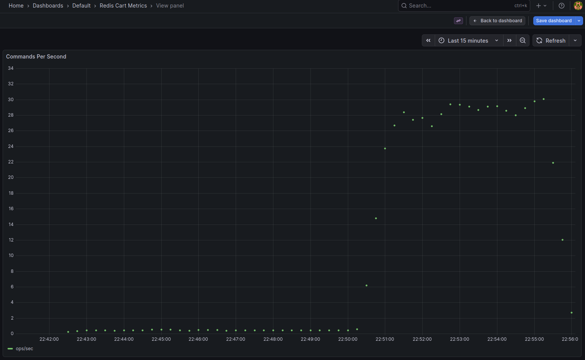

 * **Export metrics related to gRPC**

The application services already have gRPC (Remote Procedure Calls) configured, but it was necessary to expose the metrics so that Prometheus could scrape them. They use OpenTelemetry for tracing but lack Prometheus exporters for metrics. We wanted to implement it, but in the end we could not finish due to lack of time.

#### Raising alerts

To raise alerts with Prometheus, we had to configure [alerting rules](https://prometheus.io/docs/prometheus/latest/configuration/alerting_rules/). To do so, we created a new file with the the following rules:

- NodeDown: when a node exporter is unreachable
- HighNodeCPU: when CPU usage is above 80%
- HighNodeMemory: when memory usage is above 85%
- HighDiskUsage: when disk usage is above 85%

- HighPodCPU: when pod CPU usage is above 80%
- HighPodMemory: when pod memory usage is above 85%
- ContainerNotRunning: when container has no memory usage, indicating it may be down
- PodOOMKilled: when a pod is close to out of memory error and might be killed.

- RedisDown: when Redis is not reachable.
- RedisEvictingKeys: when Redis is deleting data to make space.

We could see the active alerts by accessing `http://localhost:9090/alerts`.

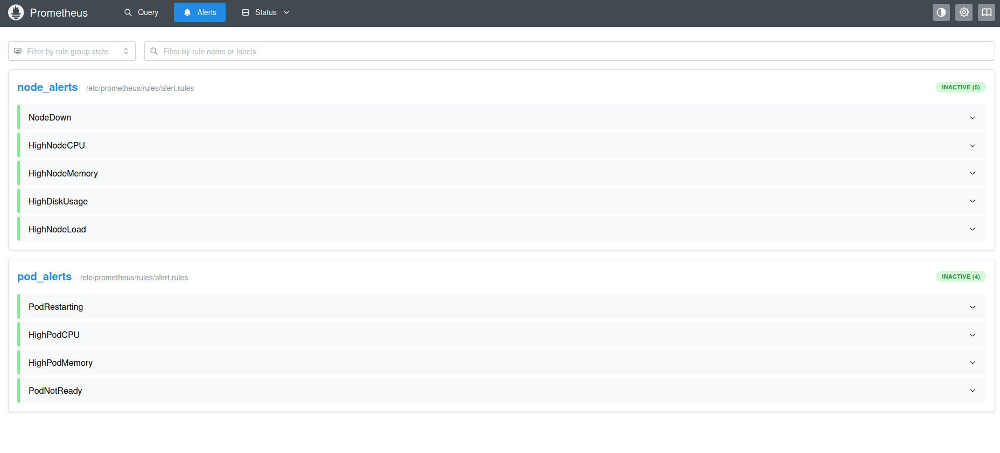


In order to receive notifications from these alerts, we had to configure [Alertmanager](https://prometheus.io/docs/alerting/latest/alertmanager/). We read the instructions on how to do it, but due to lack of time we decided to prioritize other tasks.

After implementing the bonus part of monitoring and improving Grafana's dashboards, we used Load Generator to try to trigger the alerts and to see the new graphs. The tests were not heavy enough to exceed the thresholds we had stablished, but we were able to see the results in Grafana:

We ran three times:
- users: 200, rate: 10, time: 6m
- users: 300, rate: 50, time: 6m
- users: 1000, rate: 100, time: 6m

**Redis Dashboard**

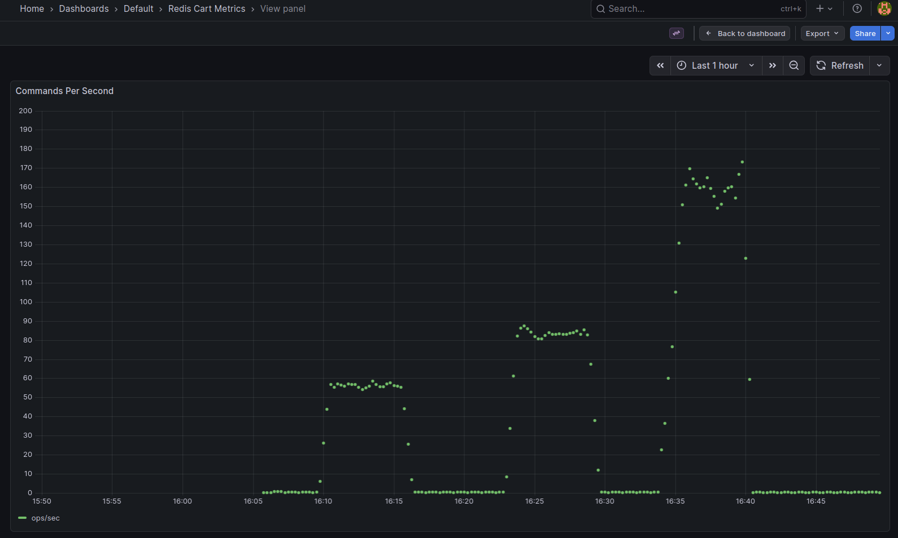

In the following graph we can see that memory usage is increasing, but no limit has been set:

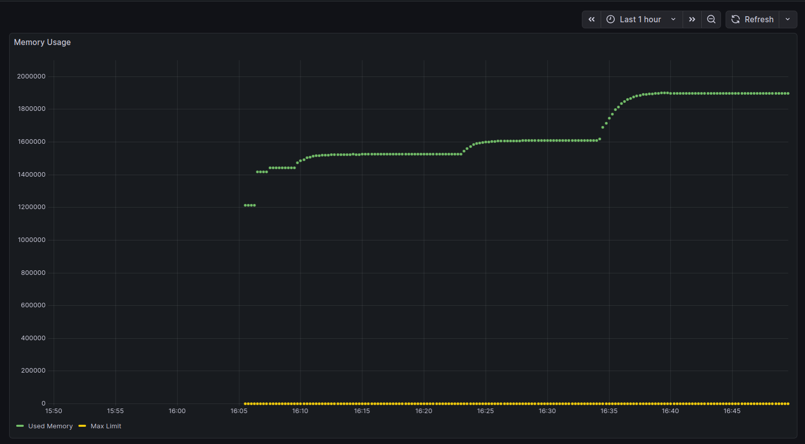

The increase in keys in database shows the three tests being executed.

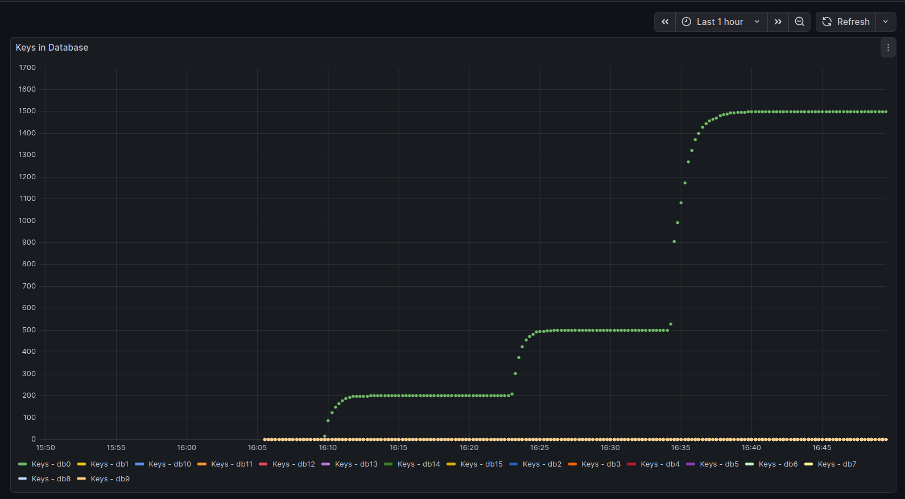

The cache hit rate also increases as the new keys are included.


For the sake of testing the alerts, we reduced some of the threshold values and tried again, and this time we could see the alerts were activated.


#### Collecting traces

We wanted to explore traces to get information about the path of requests through the application. We studied the provided [Kustomize configuration](kustomize/components/google-cloud-operations/README.md) which activates tracing, deploys the OpenTelemetry collector and connects it to Google Cloud Trace backend.

We followed the provided instructions to add the component and deploy, and we create a script to automate the setup: `add-tracing.sh`.

However, with the new configuration, currencyservice, emailservice, paymentservice and shippingservice could not be deployed. We used the investigation inside GoogleCloud to identify the issue, as well as Google Cloud Observability Error reporting to further investigate. One problem was an application error `TypeError: provider.addSpanProcessor is not a function`. It seems that addSpanProcessor was deprecated by OpentTelemetry. We tried to fix it by changing package.json and modifying the versions, using @opentelemetry/exporter-trace-otlp-grpc instead of @opentelemetry/exporter-otlp-grpc. but it dit not work. We pulled the most recent version of the services from the repository, but unfortunately we could not fix the problem.

At least we were able to confirm that the opentelemetrycollector was successfully deployed, but due to errors with the services we were not able to analyze the traces.

This issue also made us realize that some Prometheus alerts were not using the correct metrics and label names from cAdvisor, so we were able to fix the rules. We wanted to add alerts and a dashboard to track Pod restarts, but we did not find a way to do it with cAdvisor, so we removed this graph from the dashboard. From our research, it would have been easier to do it with [Kube State Metrics](https://grafana.com/blog/monitoring-kubernetes-layers-key-metrics-to-know/), but we did not implement it.


### Review of recent publications [Bonus]

For this task, we selected the article “Cloudscape: A Study of Storage Services in Modern Cloud Architectures”, by Satija et al., published in 2025. The authors present an interesting approach to investigate the current cloud scenario with respect to storage services. Based on a YouTube playlist by Amazon Web Services (AWS), they created a dataset of 396 architectures, describing systems build with AWS. This paper is interesting because it attempts to quantify and describe the way different companies use storage services in their system's workflows. The videos are not scientific presentations, but casual commercial explanations. An AWS employee asks questions to a developer working for external companies, who is responsible to present the architecture and the workflows.

The results are very interesting, showing that S3 plays a large role in the archictectures (present in 68% of the systems), whereas file system services are only mentioned in 4%. Most systems use more than one storage service, combining them for different purposes, even in a single workflow (for example, S3 with a SQL or NoSQL store). Most of the interactions happen with Lambda and EC2; with serverless computing present in 60% of the systems; The authors also identified an important presence of Machine Learning and analytics services relying on S3.

The videos are short and provide interesting insights into the architecture. In 176 videos, the authors were able to get information about the type of data stored, so they used these videos for the qualitative analysis.

However, the paper has some limitations. First, the videos are created by AWS and serve to advertise their products. Therefore, the archictecture presented possibly highlights AWS and hides other elements which in reality might also be involved. The authors highlight the absence of File Systems, but they might still be present in the architecture, but under the hood or maybe not as a main part of the workflow the companies chose to present. The authors recognize that the scope is limited to AWS, but they believe that the results and methodologies could be generalized to other providers.

Second, the authors captured "flow directions to understand the reads and writes", creating directed graphs, but it seems that they do not consider the volume or the different frequencies with which these operations occur. An edge means an interaction between two services, but we lose the difference between those which happen most frequently and are crucial for the system and those who happen occasionally. Therefore, the idea to optmize certain paths might be less productive if they are not in fact very common.

The paper also makes us reflect on how technical decisions can be made based on market standars, and not technical aspects. S3 is widely spread, and it can be convenient, but that does not mean that it is the best solution for all of the companies which use it.

